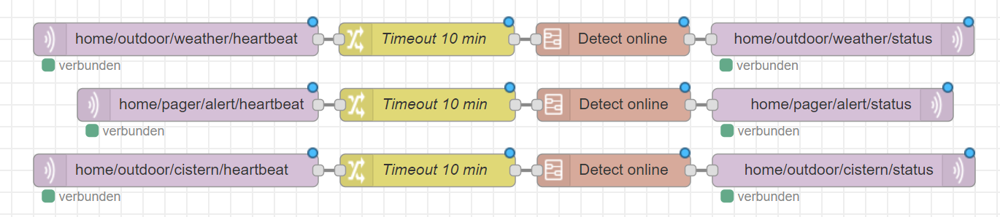

# nodered-heartbeat-status

Check for incoming MQTT messages and return of MQTT online status after timeout

## EXAMPLE

You can find the complete flow ***flows-nodered-heartbeat.json*** for import to Node-RED in this GitHub-repository.

## LICENSE

nodered-heartbeat-status and all individual scripts are under the BSD 3-Clause license unless explicitly noted otherwise. Please refer to the LICENSE